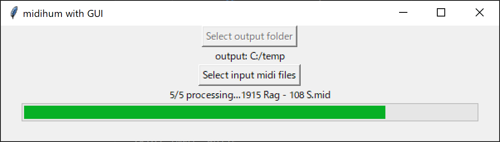

# midihum with simple GUI

forked from:
https://github.com/erwald/midihum

I added a simple GUI and compile it to exe by pyinstaller

## Requirements

* Python 3.11.6
* uv 0.6.2

## Installation
`uv sync`

## Build
`.\build_win.bat`

OR

Run release workflow of GitHub Actions.

Currently only Windows.

## Usage

1. Click "midihum_gui.exe" (takes a while to boot up)
2. Click "Select output folder"
3. Click "Select input midi files"
4. Conversion will start
5. Output folder will automatically open after conversion

If you want to cancel the conversion, just close the window.